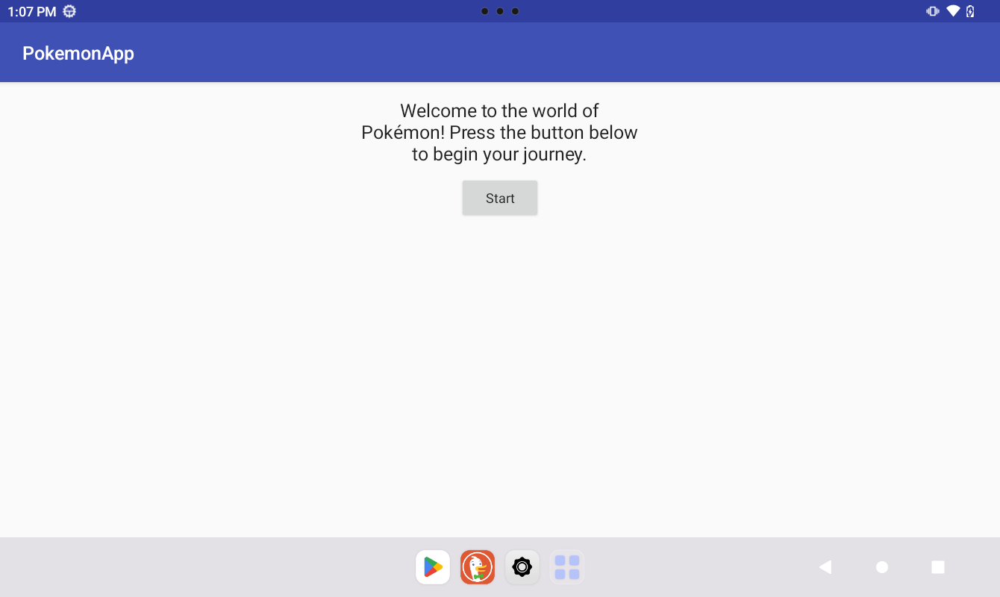
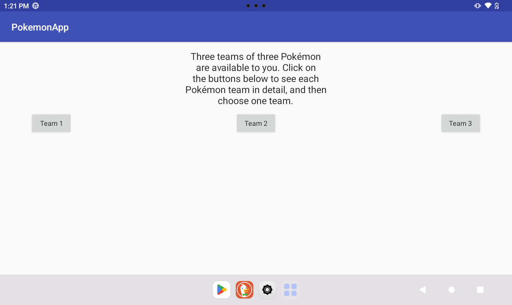
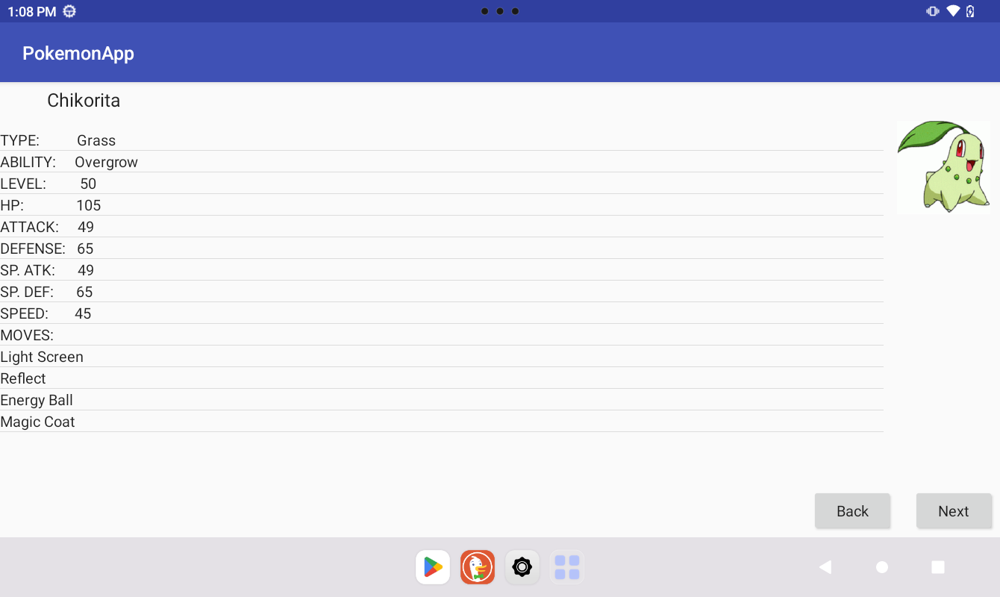
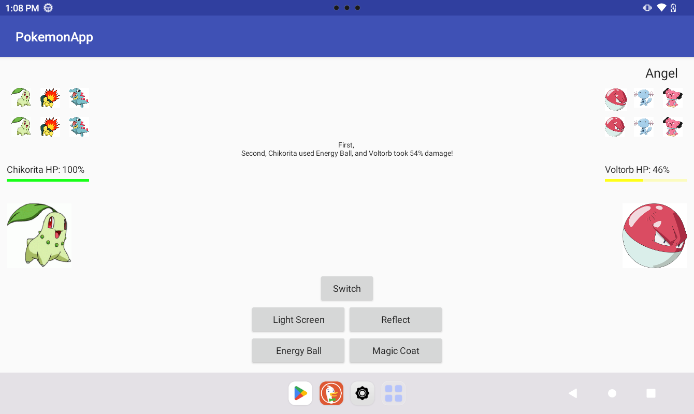

**Note: This is a very unfinished version of a single-player Android Pokémon simulator app, so many of its intended features, such as statuses, end-of-turn effects, and complex field effects, have not been implemented yet. Currently, users can mainly only use attacking moves with the first two Pokémon, so this functionality can be tested with the instructions below.**

To test the Pokémon app's in its current state, follow the instructions below:

1. If necessary, download Android Studio, and ensure that it is set up for development on Android 33+.

2. In the terminal, clone the repository to its own folder with the following command:

`git clone https://github.com/Irving7954/Pokemon-Simulator-App`

3. In Android Studio, open the `PokemonApp` folder as a new Android project.

4. In Android Studio, create an Android 33+ emulator, or connect an Android 33+ device to your computer. If you are using an actual Android device, connect your device to Android Studio in whatever way you prefer, such as turning on developer mode by clicking the build number five times and enabling USB debugging.

5. In Android Studio, build the project in Gradle, and then run or debug the app on your Android emulator or device. If you are using an actual Android device, this should install the app on your machine. On either version of the Android app, you should see the following introductory screen:

6. Select the Start button to advance to the Team Selection screen, which is illustrated below:

7. Using the buttons on the Team Selection screens, choose your team of three Pokémon, and then advance to the Battle Simulator screen. For reference, here is an image of the Team Selection screen with the team's first Pokémon after one of the teams has been selected:

8. On the Battle Simulator screen, enter your name, and then start battling by selecting a move, which must be an attacking move at this point. For reference, here is an image of the Battle Simulator screen once you have started battling:

9. Have fun battling on the simulator!